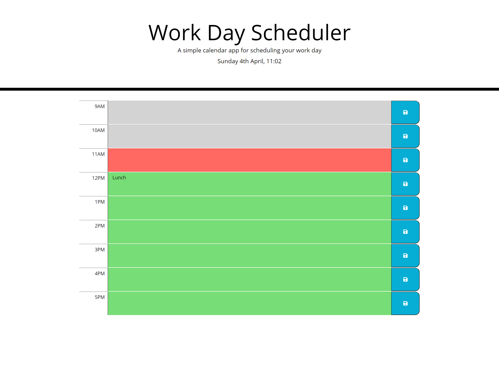

# Work-Day-Scheduler

This application has been created as a simple calendar application that allows a user to save events for each hour of the day by modifying starter code. This app will run in the browser and feature dynamically updated HTML and CSS.

At the top of the page the current local date and time is displayed for the users ease. For the users reference:

Gray indicates that this is past the current hour
Red indicates that this is the current hour
Green indicates that this is before the current hour

Work Day Schedule appears as:

## Deployed Link

Final URL: https://shelbyrp.github.io/Work-Day-Scheduler/

## HTML

Utilising the provided HTML framework, timeblocks were added to the HTML in the form of div elements. Within these elements are span elements for the hour to be displayed, text area's to allow the users to enter their work day tasks into the schedule and a save button once the user has completed entering the task.

Class items and Id's have been added to the HTML to utlising Bootstrap and to apply styling.

JavaScript and jQuery files are also linked to this HTML document.

## CSS

Style elements have been created for each of the page elements. A future, past and present class has been created so that it can be applied to the HTML dynamically via JavaScript to show when a time block is the current time block, the past timeblock or a future timeblock.

## JS

To dynamically change the HTML and update CSS, the following is featured in the script:

* Moment.js for current date and current time
* JSON
* jQuery
* If/else statements
* Event listeners

# License

@ Shelby R Pignat

Licensed under the [MIT](LICENSE) license.
